# Mini CRM — Companies & Employees Admin Panel

A small admin panel for managing **companies** and their **employees**, built for the
FNXperts Sdn. Bhd. Web Developer Assessment (Laravel).

**Stack:** Laravel 13 · PHP 8.3 · Vue 3 + TypeScript · Inertia.js v3 · Tailwind CSS v4 (shadcn-vue) ·
Laravel Fortify (auth) · Laravel Sanctum (API tokens) · Laravel Wayfinder (typed routes) · PHPUnit · Larastan

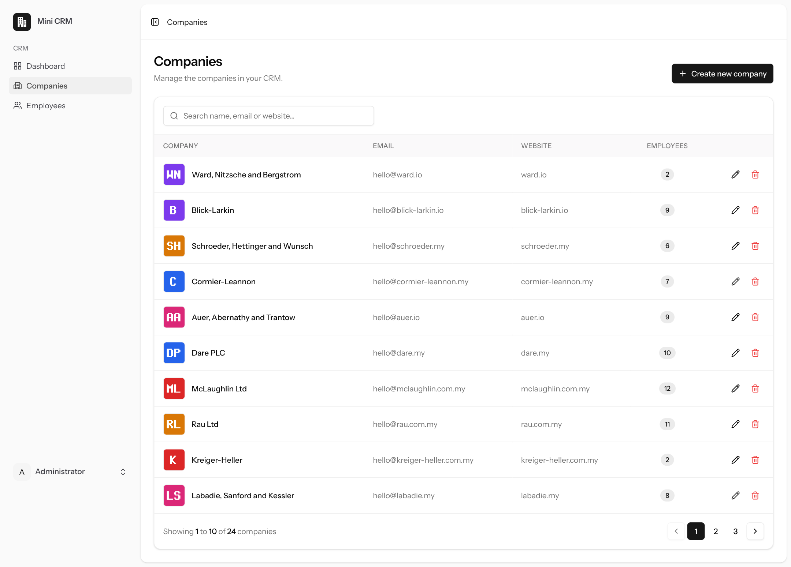

---

## Requirements checklist

| Requirement                                                           | Where / how                                                                                                                                                                                      |
| --------------------------------------------------------------------- | ------------------------------------------------------------------------------------------------------------------------------------------------------------------------------------------------ |
| Basic authentication (admin login)                                    | Official Laravel Vue starter kit (Fortify + Inertia). Login, password reset, 2FA and password confirmation kept.                                                                                 |
| Seeded admin `admin@admin.com` / `password`                           | [`AdminUserSeeder`](database/seeders/AdminUserSeeder.php) — idempotent (`updateOrCreate`), so re-seeding never duplicates the admin.                                                             |
| CRUD for Companies and Employees                                      | [`CompanyController`](app/Http/Controllers/CompanyController.php), [`EmployeeController`](app/Http/Controllers/EmployeeController.php) + Vue pages in [`resources/js/pages`](resources/js/pages) |
| Companies table: name (required), email, logo, website                | [`create_companies_table`](database/migrations/2026_10_03_000001_create_companies_table.php)                                                                                                     |
| Employees table: first/last name (required), company FK, email, phone | [`create_employees_table`](database/migrations/2026_10_03_000002_create_employees_table.php)                                                                                                     |
| Migrations + Eloquent relationships                                   | `Company hasMany Employee`, `Employee belongsTo Company` ([models](app/Models))                                                                                                                  |
| Logo ≥ 100×100, stored in `storage/app/public`, publicly accessible   | Stored under `storage/app/public/logos`, served via `php artisan storage:link`. Validated with `dimensions:min_width=100,min_height=100`, plus an instant client-side check.                     |
| Validation with Request classes                                       | [`app/Http/Requests`](app/Http/Requests) — `Store*/Update*Request` per resource                                                                                                                  |
| Pagination, 10 per page                                               | `paginate(10)` on both lists (and on the employees list inside a company)                                                                                                                        |
| Resource controllers                                                  | `Route::resource('companies', …)` / `Route::resource('employees', …)` ([routes/web.php](routes/web.php))                                                                                         |
| Starter kit with registration **disabled**                            | Registration feature removed from Fortify (`config/fortify.php`), register page/action deleted; `/register` returns 404 (covered by a test).                                                     |
| API **and** web routes                                                | [`routes/web.php`](routes/web.php) and [`routes/api.php`](routes/api.php)                                                                                                                        |
| API: single company with its employees + `employee_count`             | `GET /api/v1/companies/{id}` → [`CompanyResource`](app/Http/Resources/CompanyResource.php)                                                                                                       |
| Testable with Postman                                                 | Ready-made collection: [`docs/postman/Mini-CRM.postman_collection.json`](docs/postman/Mini-CRM.postman_collection.json)                                                                          |
| Screenshots of CRUD UI, pagination, API response                      | [`docs/screenshots`](docs/screenshots) (see below)                                                                                                                                               |

### Extras beyond the brief

- **Token-secured API** (Sanctum). Employee data is personal data, so the API is not public:
  get a token with your admin credentials, then call the API with `Authorization: Bearer …`.
  Login is rate-limited (6/min) and tokens can be revoked.
- **Clean JSON errors** for the API (`401`, `404 {"message":"Resource not found."}`, `422` validation).
- **Search & filters** on both lists (debounced, kept in the query string so pagination links keep them).
- **Safe deletes:** deleting a company deletes its logo file and keeps its employees as _Unassigned_
  (`nullOnDelete` FK) instead of silently wiping them; the confirm dialog says how many are affected.
- **Old logo files are removed** when a logo is replaced or removed — no orphaned uploads.
- **Input normalisation:** emails lower-cased, `xperts.my` → `https://xperts.my`, names trimmed.
- **No N+1 queries:** counts use `withCount()`, lists eager-load the company.
- **Dashboard** with totals and recent records; flash toasts after every create/update/delete.
- **63 feature tests** (CRUD, validation, logo storage, pagination, auth, API) + Larastan + Pint + CI workflow.
- **Demo data seeder** (24 companies with generated logos, ~200 employees) so pagination is visible immediately.

---

## Getting started

### Requirements

PHP 8.3+ (with `gd`, `pdo_sqlite` or `pdo_mysql`, `fileinfo`), Composer 2, Node.js 22+.

### Install

```bash
git clone <this-repo-url> mini-crm
cd mini-crm

composer install
cp .env.example .env
php artisan key:generate

npm install
npm run build
```

### Database

SQLite works out of the box (`DB_CONNECTION=sqlite` in `.env.example`):

```bash
touch database/database.sqlite          # Windows: type nul > database\database.sqlite
php artisan migrate --seed
```

To use **MySQL** instead, update `.env` and run the same command:

```dotenv
DB_CONNECTION=mysql
DB_HOST=127.0.0.1
DB_PORT=3306
DB_DATABASE=mini_crm
DB_USERNAME=root
DB_PASSWORD=
```

`--seed` creates the admin user and, outside production, the demo data.
Seed only the admin with `php artisan db:seed --class=AdminUserSeeder`.

### Make uploaded logos public

```bash
php artisan storage:link
```

### Run

```bash
php artisan serve        # http://localhost:8000
# or, with hot reload for the Vue front end:
composer dev
```

Log in with **admin@admin.com / password**.

---

## API

Base URL: `http://localhost:8000/api/v1` · always send `Accept: application/json`.

| Method   | Endpoint          | Auth   | Description                                                                          |
| -------- | ----------------- | ------ | ------------------------------------------------------------------------------------ |
| `POST`   | `/auth/token`     | —      | Exchange `email` + `password` (+ optional `device_name`) for a Bearer token          |
| `GET`    | `/companies/{id}` | Bearer | **One company with its employees and `employee_count`**                              |
| `GET`    | `/companies`      | Bearer | Paginated companies with `employee_count` (`?page=`, `?per_page=` 1–100, `?search=`) |
| `DELETE` | `/auth/token`     | Bearer | Revoke the current token                                                             |

### Quick test with curl

```bash
TOKEN=$(curl -s -X POST http://localhost:8000/api/v1/auth/token \
  -H "Accept: application/json" \
  -d email=admin@admin.com -d password=password | php -r 'echo json_decode(stream_get_contents(STDIN))->access_token;')

curl -s http://localhost:8000/api/v1/companies/1 \
  -H "Accept: application/json" -H "Authorization: Bearer $TOKEN"
```

### Example response — `GET /api/v1/companies/15`

```jsonc
{
    "data": {
        "id": 15,
        "name": "Harris, Johnston and Cruickshank",
        "email": "hello@harris.io",
        "website": "https://www.harris.io",
        "logo_url": "http://localhost:8000/storage/logos/7158080e-5fb2-46ea-b561-aee28c29dae3.png",
        "employee_count": 4,
        "employees": [
            {
                "id": 118,
                "first_name": "Jacquelyn",
                "last_name": "Kertzmann",
                "full_name": "Jacquelyn Kertzmann",
                "email": "jacquelyn.kertzmann5288@example.com",
                "phone": "+60 17-821 5312",
                "company_id": 15,
                "created_at": "2026-10-03T08:46:31+00:00",
                "updated_at": "2026-10-03T08:46:31+00:00",
            },
            // … 3 more employees
        ],
        "created_at": "2026-10-03T08:46:31+00:00",
        "updated_at": "2026-10-03T08:46:31+00:00",
    },
}
```

### Postman

1. Import [`docs/postman/Mini-CRM.postman_collection.json`](docs/postman/Mini-CRM.postman_collection.json).
2. Run **1. Auth → Issue token** — its test script stores the token in the `token` collection variable.
3. Run **2. Companies → Get company with employees** (change the `company_id` variable as needed).

The collection includes assertions (status codes, `employee_count` present and equal to the number of
employees, 404 and 401 cases) and passes end-to-end with Newman:
`npx newman run docs/postman/Mini-CRM.postman_collection.json`.

---

## Tests & code quality

```bash
php artisan test            # 63 feature tests
vendor/bin/phpstan analyse  # Larastan
composer lint               # Laravel Pint
npm run check               # frontend lint + format
npm run types:check         # vue-tsc
```

What the tests cover: admin seeding & login, registration disabled, guest redirects, company/employee
CRUD, required fields and format validation, logo minimum size / type, logo stored on the public disk,
old logo removed on replace/remove/delete, employees unassigned when their company is deleted,
10-per-page pagination, search and company filter, API token issue/revoke, API auth, response structure
and `employee_count`, clean 404s.

A GitHub Actions workflow (`.github/workflows/tests.yml`) runs the full check suite on every push.

---

## Screenshots

|                                                                                           |                                                                                                |
| ----------------------------------------------------------------------------------------- | ---------------------------------------------------------------------------------------------- |
| **Login** 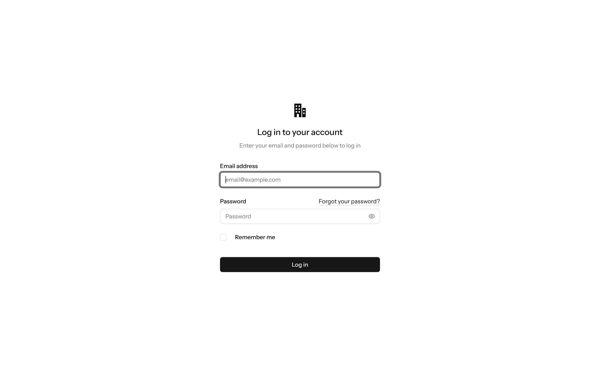                                              | **Dashboard** 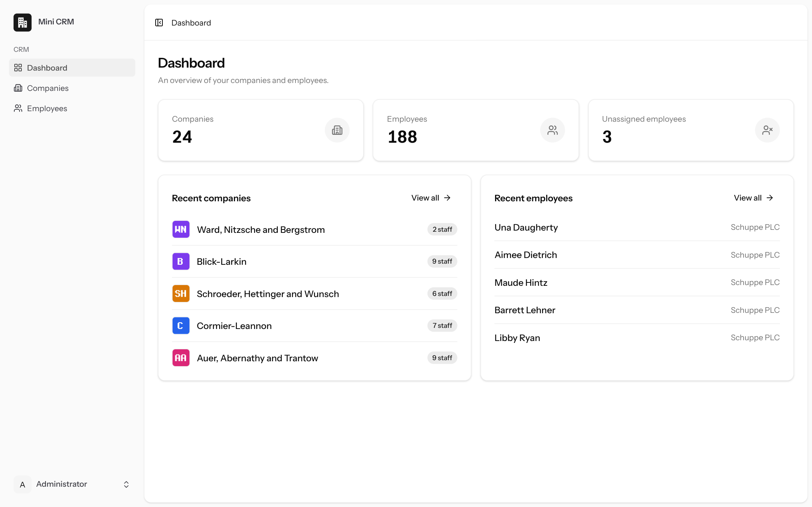                                           |
| **Companies – page 1 of 3**             | **Companies – page 2** 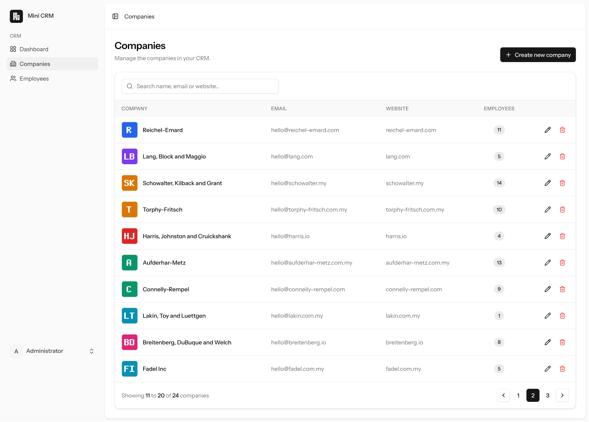                      |
| **Validation errors** 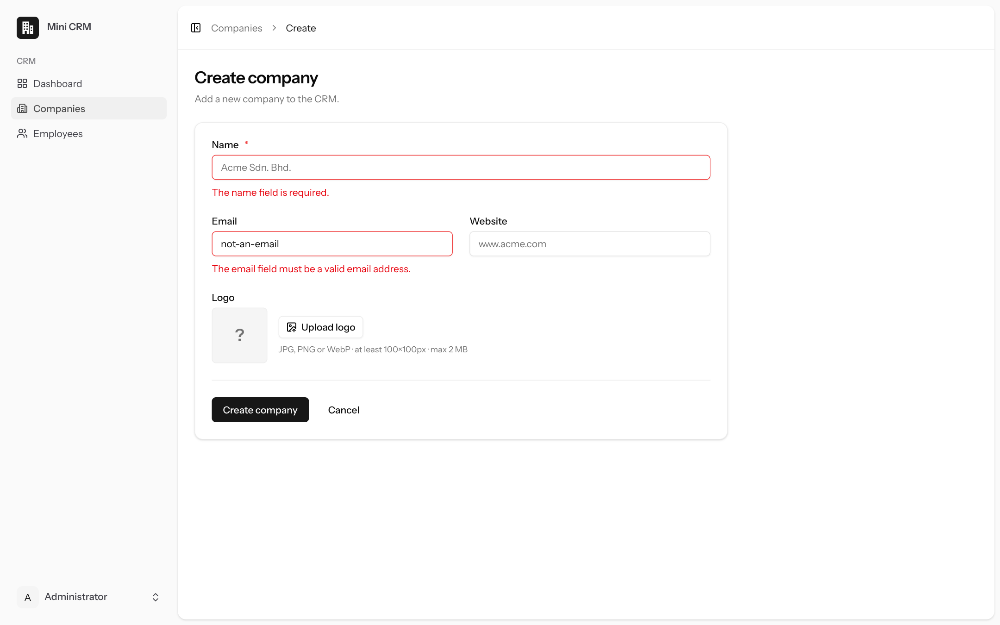              | **Create with logo preview** 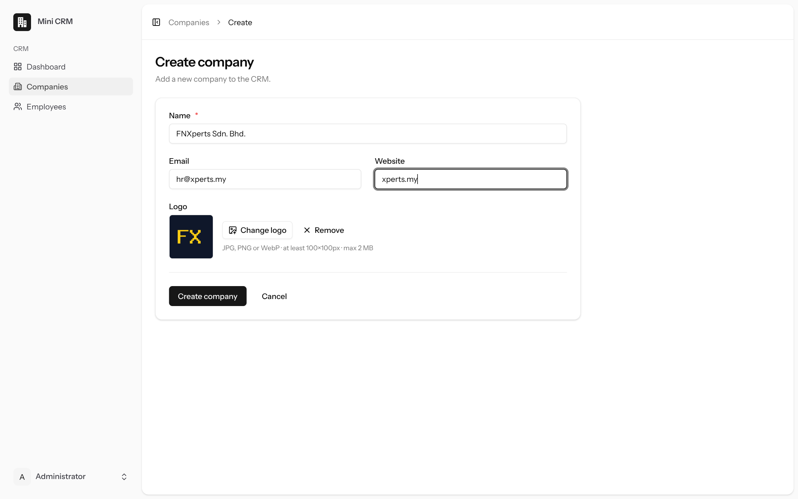                |
| **Company created (toast) + employees** 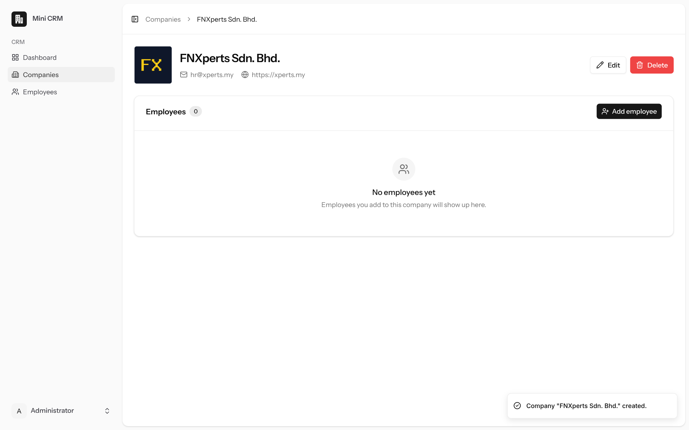 | **Edit company** 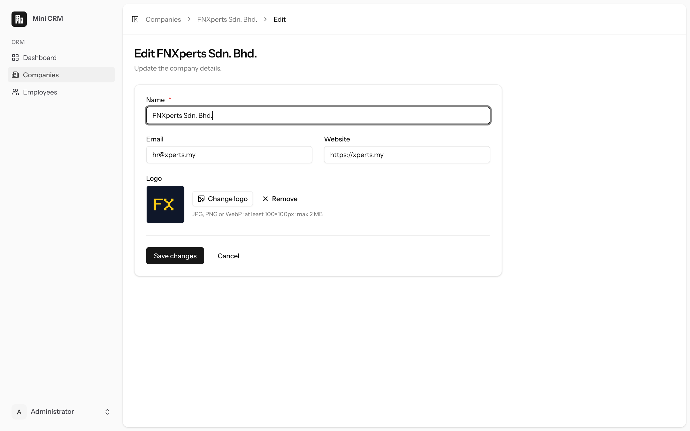                                     |
| **Create employee** 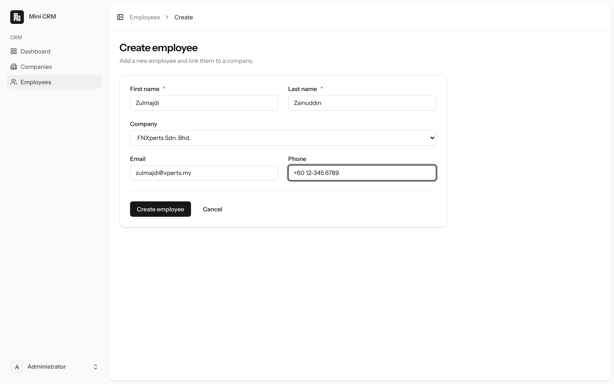                          | **Employee details** 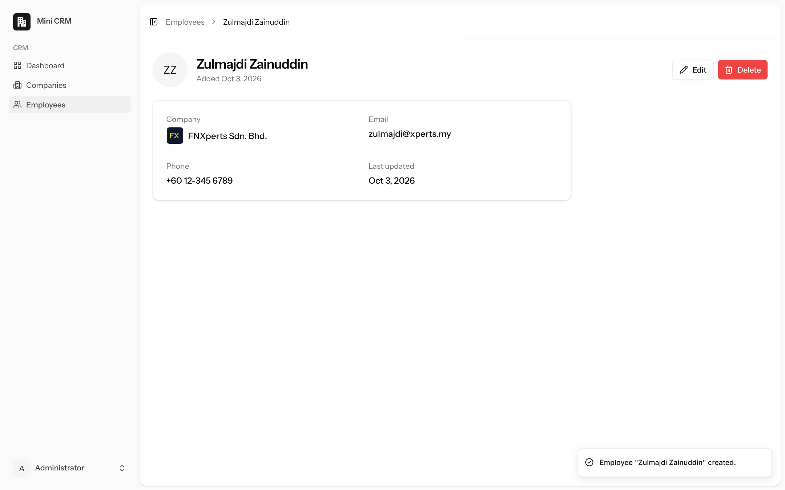                                |
| **Employees – 10 per page** 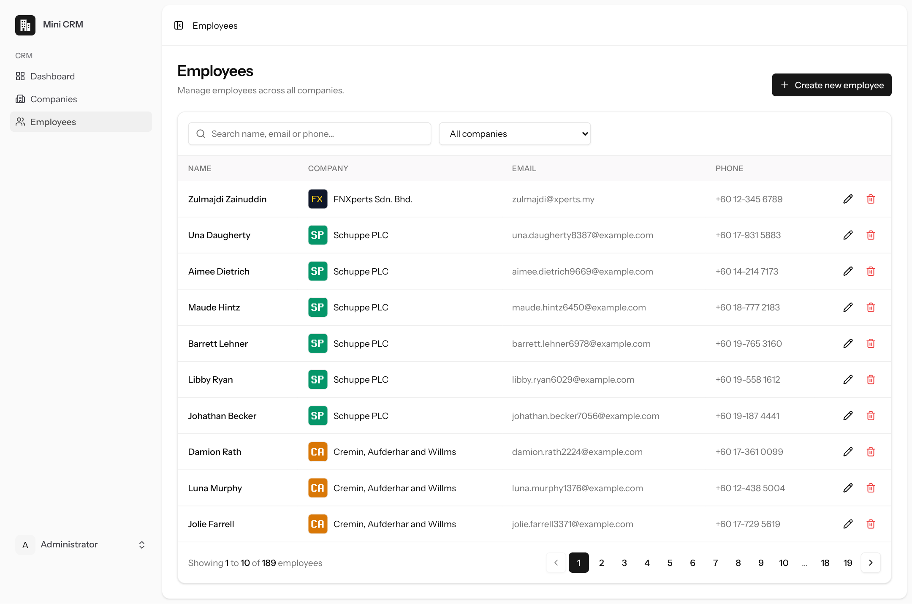                  | **Employees – page 3** 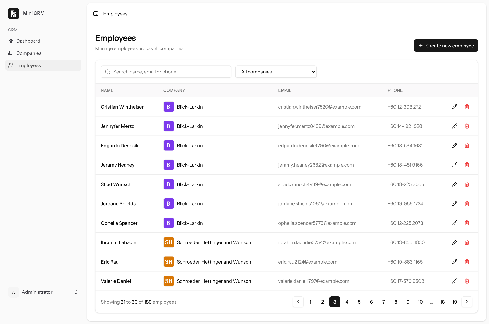                      |
| **Delete confirmation** 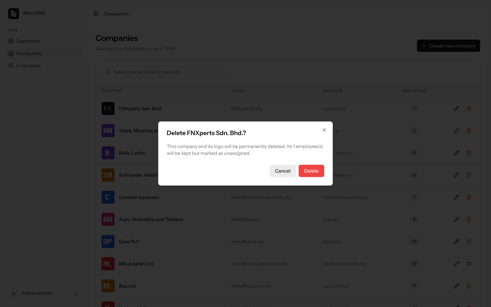               | **Search** 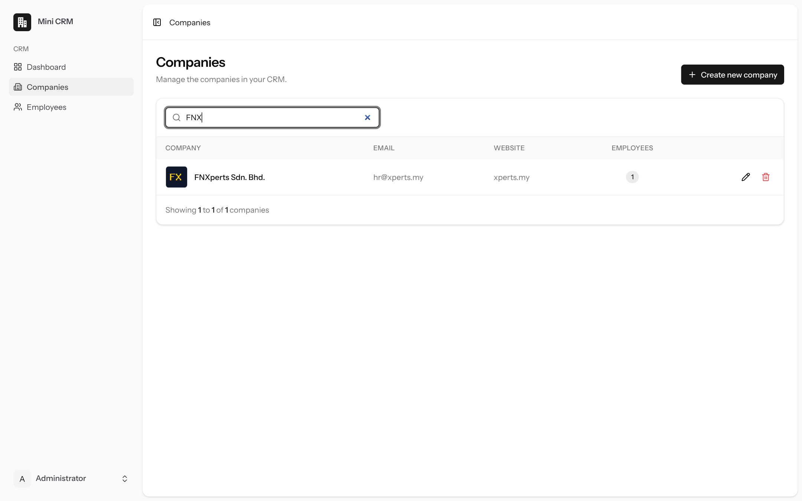                                       |
| **Registration disabled (404)**         | **API response with `employee_count`** 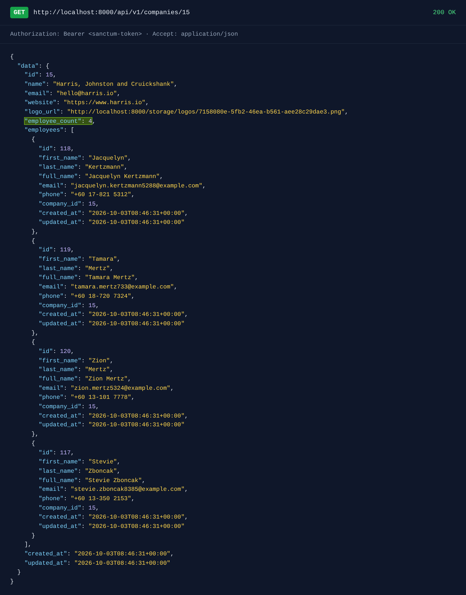 |

---

## Project structure (the parts written for this assessment)

```
app/
  Http/Controllers/
    CompanyController.php          # web resource controller (Inertia)
    EmployeeController.php         # web resource controller (Inertia)
    DashboardController.php
    Api/V1/CompanyController.php   # API: index + show (employee_count)
    Api/V1/AuthTokenController.php # API: issue / revoke Sanctum tokens
  Http/Requests/{Company,Employee,Api}/   # Form Request validation
  Http/Resources/{Company,Employee}Resource.php
  Models/{Company,Employee}.php
database/
  migrations/2026_10_03_*          # companies, employees, personal_access_tokens
  factories/{Company,Employee}Factory.php
  seeders/{AdminUser,DemoData,Database}Seeder.php
resources/js/
  pages/{Dashboard.vue, companies/*, employees/*}
  components/crm/*                 # table pagination, logo, delete dialog, forms…
  composables/useListFilters.ts    # debounced search synced to the query string
routes/{web,api}.php
tests/Feature/{Crm,Api}/*
docs/{postman,screenshots}/
```

### Design decisions

- **Inertia + Vue instead of a separate SPA:** keeps Laravel's routing, validation and session auth
  while giving a Vue front end — no duplicated API layer for the admin UI.
- **Employees survive company deletion** (`nullOnDelete`). Losing staff records because a company
  record was removed is rarely what an admin intends; they can be reassigned later.
- **The API is versioned (`/api/v1`) and token-protected** so it can evolve without breaking clients.
- **Logos are stored with hashed file names** on the `public` disk, so user-supplied names never reach the filesystem.
